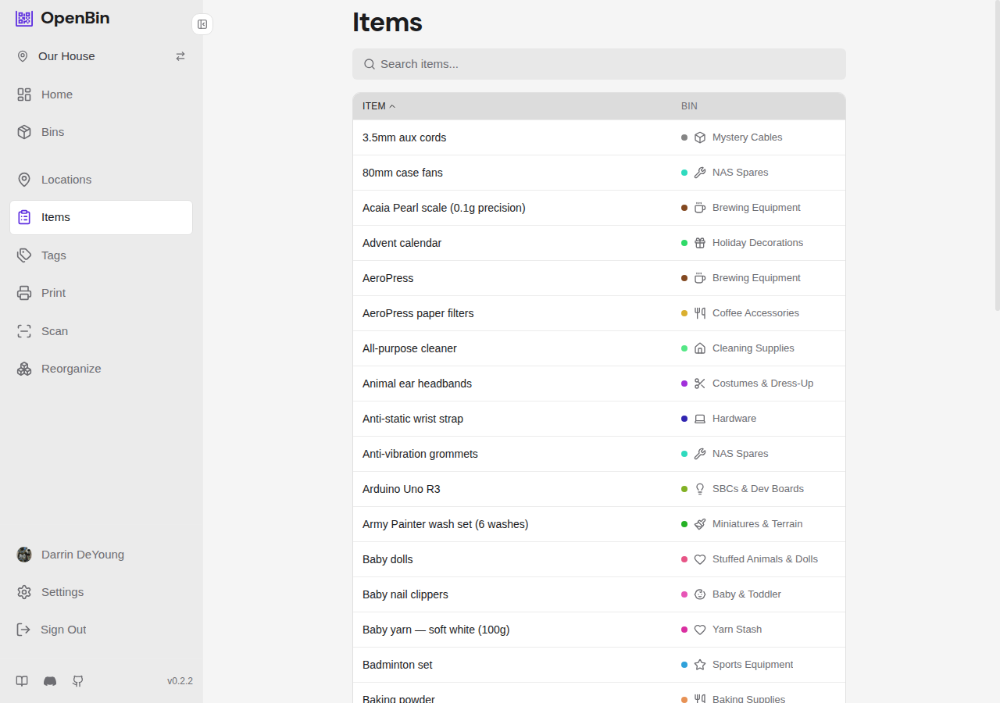
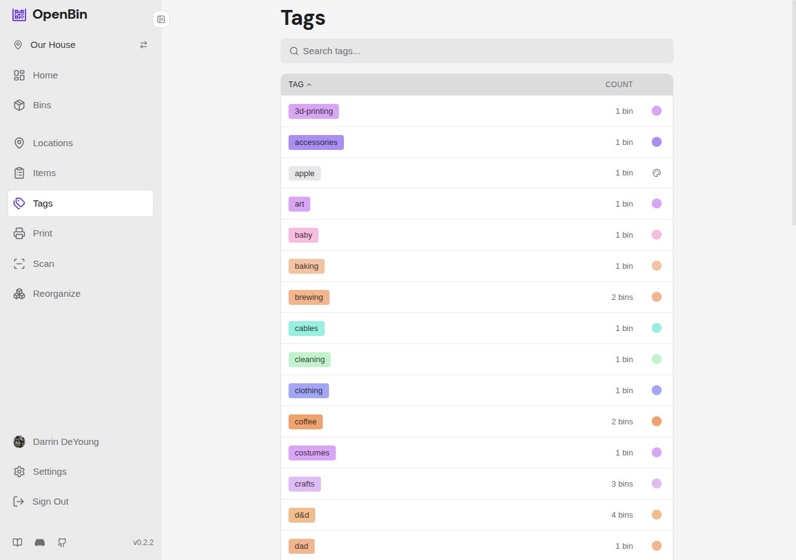

---
prev:
  text: 'Import & Export'
  link: '/docs/guide/import-export'
next:
  text: 'Account & Profile'
  link: '/docs/guide/profile'
---

# Items & Tags

## Items page

Lists every item across all bins in the active location.

- **Search** by item name to find which bin holds a specific thing.
- **Sort** by item name (alphabetical) or by bin name to group items by their container.
- **Quantity** is shown next to each item when tracked — items without a quantity display no count.
- **Paginated** results keep the page fast even for locations with thousands of items.

Clicking an item navigates directly to its parent bin's detail page.

::: tip
The Items page is the fastest way to answer "which bin has the Phillips screwdriver?" — just search for it and tap the result.
:::

## Tags page

Lists every tag used in the active location.

- **Search** by tag name to find a specific tag.
- **Sort** by tag name (alphabetical) or by usage count to see which tags are most common.
- Each tag shows how many bins use it.

Clicking a tag opens the bin list filtered to only bins with that tag applied.

## Tag Colors

Tags can be assigned a custom color that appears consistently throughout the app — on bin cards, in the filter panel, and on tag badges.

Tag colors are set **per location**, so different locations can use different color schemes for the same tag name.

### Setting a Tag Color

Tap the color indicator next to any tag on the Tags page to assign a color. Colors are visible to all location members. Clear the assignment to revert to the default appearance.
