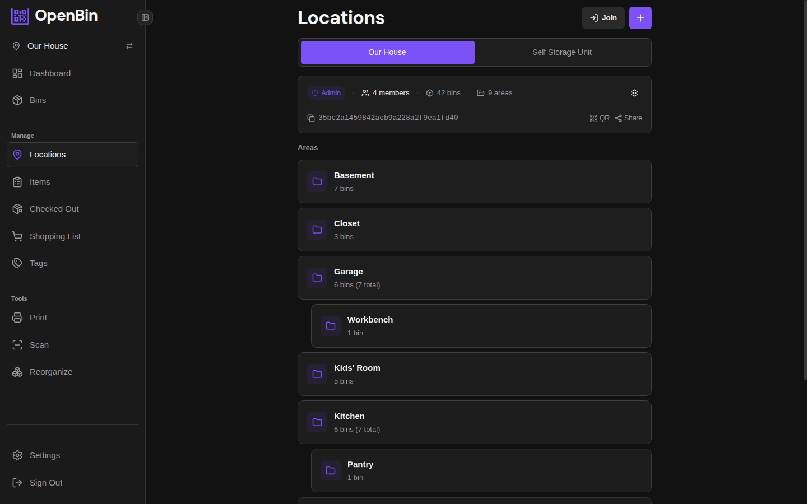
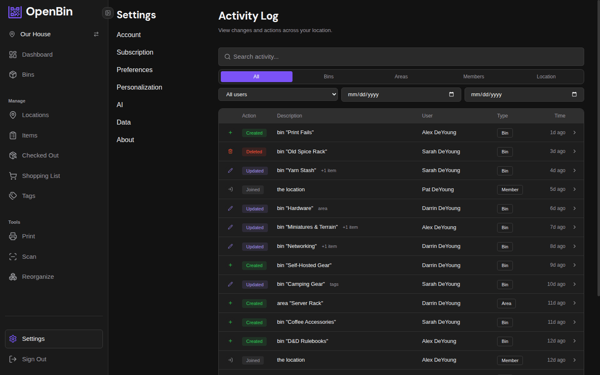

---
prev:
  text: 'User Guide'
  link: '/docs/guide/'
next:
  text: 'Bins'
  link: '/docs/guide/bins'
---

# Locations & Areas

Everything — bins, areas, members, settings — lives inside a location. Areas are optional sub-zones for grouping bins.

## Creating a Location

You become the admin of any location you create.

## Joining a Location

Join a location by entering an invite code shared by an admin. You join with the location's default role (typically member).

::: tip
Invite codes can be regenerated by an admin at any time, which invalidates the previous code.
:::

## Roles

| Role | Capabilities |
|---|---|
| **Admin** | Full control: manage members, change settings, create/rename/delete areas, move bins between locations |
| **Member** | Add, edit, and delete their own bins; view all location bins; cannot manage members or location settings |
| **Viewer** | Read-only access: browse bins, scan QR codes, and search. Cannot create, edit, delete, or pin bins |

Admins can change any member's role from **Location Settings → Members**. The member list shows each person's display name alongside their username, so you can tell members apart even if display names are similar.

### Default Join Role

Admins can set the default role for new members joining via invite code. Go to **Location Settings → Default Join Role** and choose **Member** or **Viewer**. This does not affect existing members.

## Registration Modes

The `REGISTRATION_MODE` environment variable controls who can create an account (`open`, `invite`, or `closed`). See [Configuration](/docs/getting-started/configuration) for details. When set to `invite`, new users enter an invite code during sign-up and are automatically added to the corresponding location.

## Areas

Areas are sub-zones within a location. Examples: "Garage", "Attic", "Basement", "Shelf A". Each bin can belong to at most one area. Bins without an area appear under "Unassigned" in filters.

### Hierarchy

Areas can be nested to form a tree. For example, "Garage" can contain "Workbench" and "Tool Cabinet" as sub-areas, and "Workbench" can contain "Top Drawer" under it. There is no depth limit.

The areas page shows this as a collapsible tree. Each parent area includes a count of bins in all of its sub-areas.

When you filter by a parent area, bins in all of its sub-areas are included in the results.

::: info
A parent is set at creation and cannot be changed afterward. To reparent an area, delete it and recreate it under the new parent.
:::

### Creating and Renaming Areas

Only admins can create, rename, or delete areas.

- **Create**: Location settings → Areas → Add Area. Select a parent to nest it under an existing area, or leave blank for top-level.
- **Rename**: Location settings → Areas → edit the area name.
- **Delete**: Deleting an area also deletes all of its sub-areas. Bins in the deleted area and its sub-areas become unassigned.

Areas are scoped to a single location. Moving a bin to another location clears its area assignment.

## Customizable Terminology

Admins can rename the core terms to match their use case. For example, a warehouse might call bins "Boxes" and areas "Aisles".

Navigate to **Location Settings → Terminology** to override:

| Default term | Example override |
|---|---|
| Bin | Box, Container, Crate |
| Area | Room, Shelf, Aisle |
| Location | Site, Warehouse, Facility |

The new terms appear throughout the UI for all members of that location.

## Activity Log

Every location keeps a per-location activity log. It records who did what and when — bin creations, edits, deletes, photo uploads, member joins, and more.

Access it from **Location Settings → Activity Log**.

::: info
Retention period for activity log entries is configurable by admins. Entries older than the configured number of days are automatically purged.
:::

## Trash and Retention

Deleted bins are not immediately removed — they move to a trash area where they can be restored. Admins configure how long trashed bins are kept before permanent deletion.

- **Restore**: Settings → Trash → find the bin → Restore.
- **Permanent delete**: Permanently removes the bin and all its photos. Cannot be undone.
- **Retention period**: Configured in Location Settings. Bins older than this limit in trash are purged automatically.
