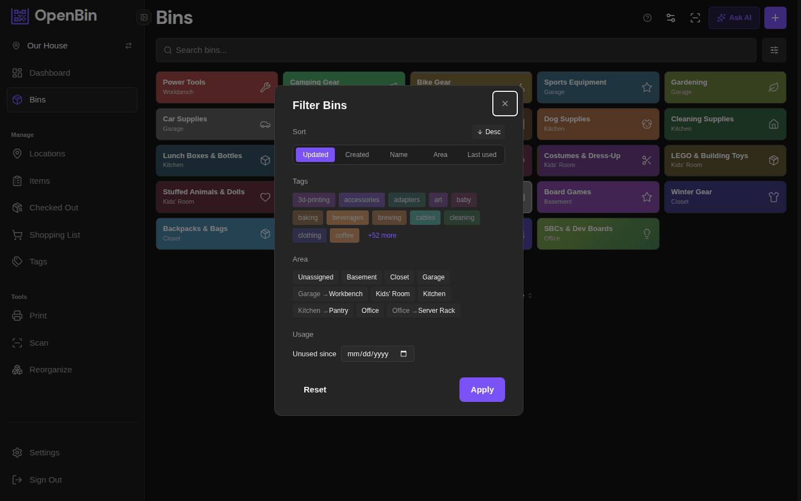

# Search & Filter

## Search bar

The search bar at the top of the bin list searches across:

- Bin names
- Item names (items inside bins)
- Tags
- Notes
- Bin ID (short code)
- Area name

Search is typo-tolerant — minor spelling mistakes and near-matches still return results. Results update as you type. Clearing the search bar returns the full list.

## Filter Panel

Click the **Filter** button (or funnel icon) to expand the filter panel. Filters can be combined — all active filters are applied together.

### Filter by Tag

Select one or more tags from the tag list. By default, bins matching **any** of the selected tags are shown. Switch the tag mode to **All** to show only bins that have every selected tag.

### Filter by Area

Select an area to show only bins assigned to it. Choose **Unassigned** to show bins with no area.

## Sort Options

Use the **Sort** menu to change the order of bins:

| Sort option | Description |
|---|---|
| Name A–Z | Alphabetical ascending |
| Name Z–A | Alphabetical descending |
| Created (newest) | Most recently created first |
| Created (oldest) | Oldest first |
| Updated (newest) | Most recently edited first |
| Area | Grouped by area name |

## Column Visibility

In the **list view** (table mode), use the column visibility menu to toggle which columns are displayed:

- Name
- Area
- Tags
- Item count
- Created date
- Updated date

Column preferences are saved per session.

## Saved Views

Save frequently-used filter and sort combinations as named views:

1. Set your desired filters and sort order.
2. Click the **Save View** button.
3. Enter a name for the view and confirm.

Saved views appear on the [Dashboard](/docs/guide/dashboard) as quick-access buttons. Clicking a saved view opens the bin list with those filters pre-applied.

::: tip
Saved views are personal — they are stored per user, not shared across the location.
:::
