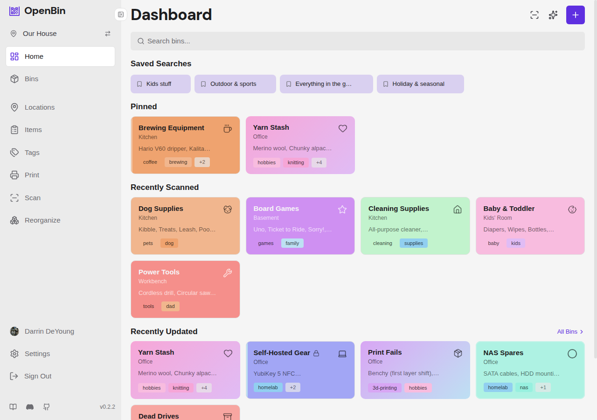
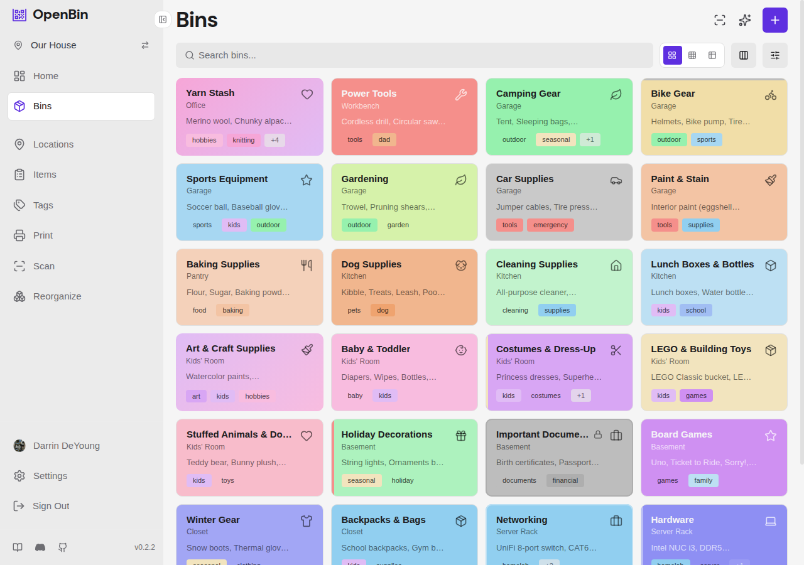
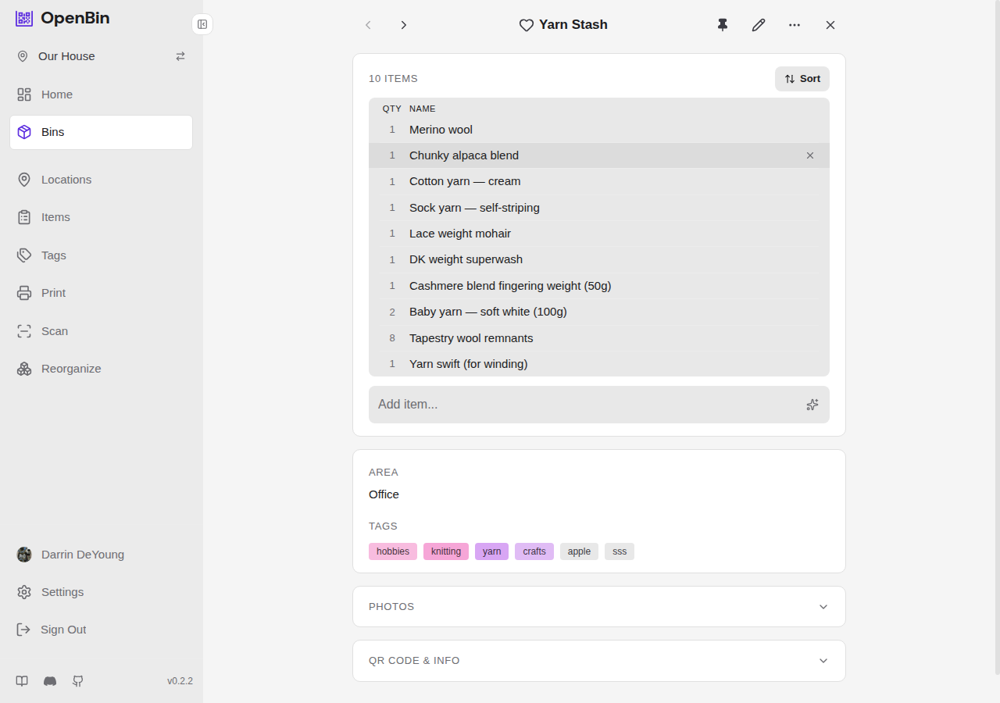
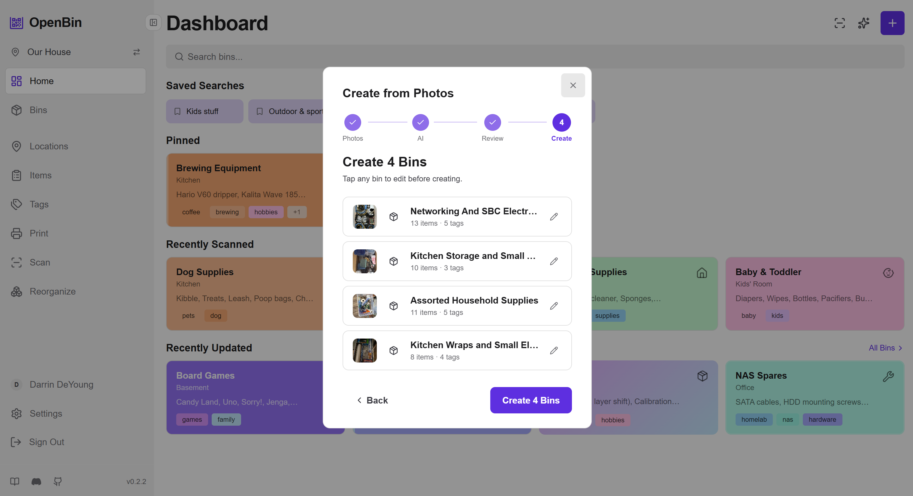
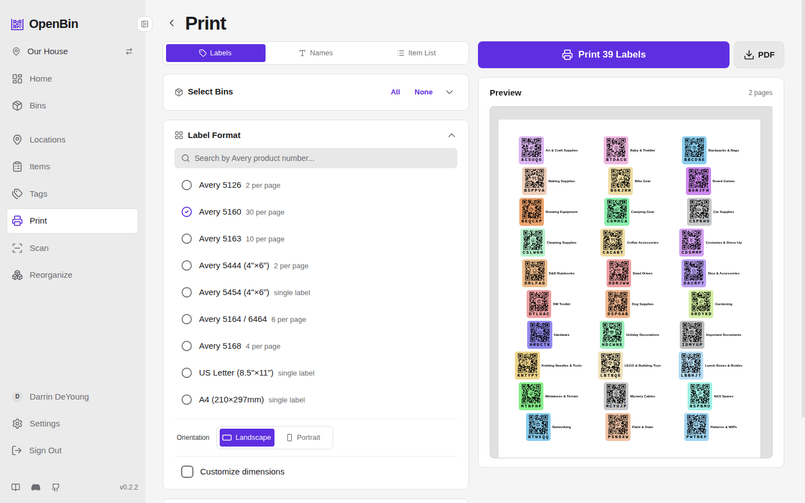
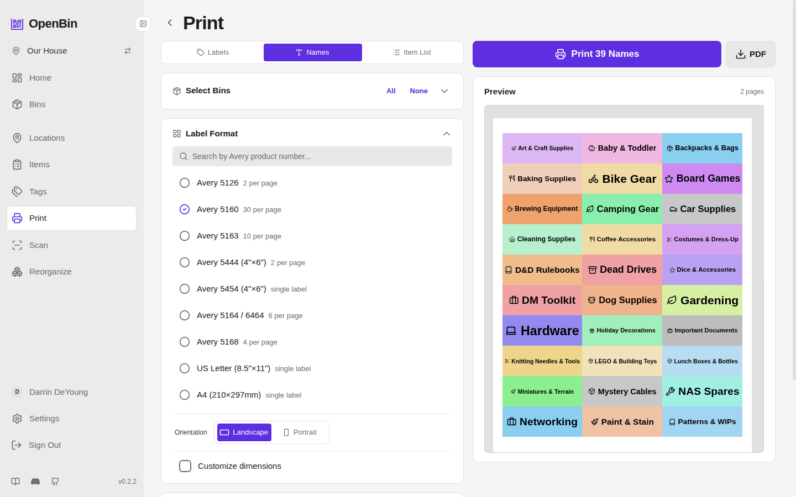
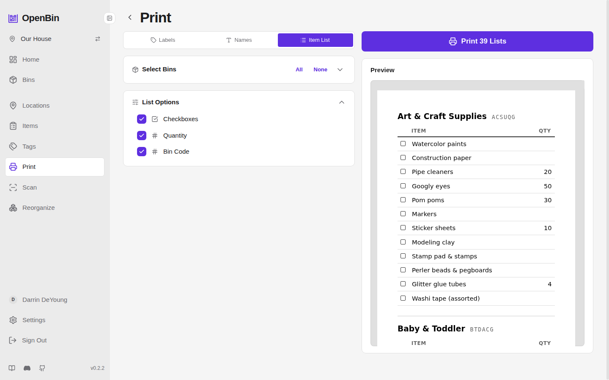
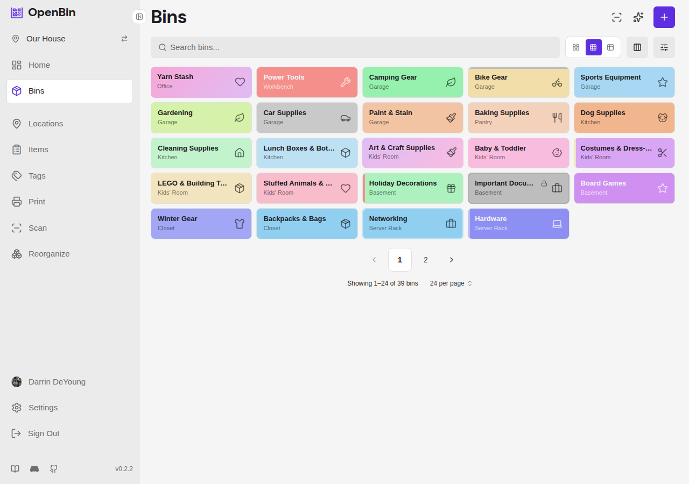
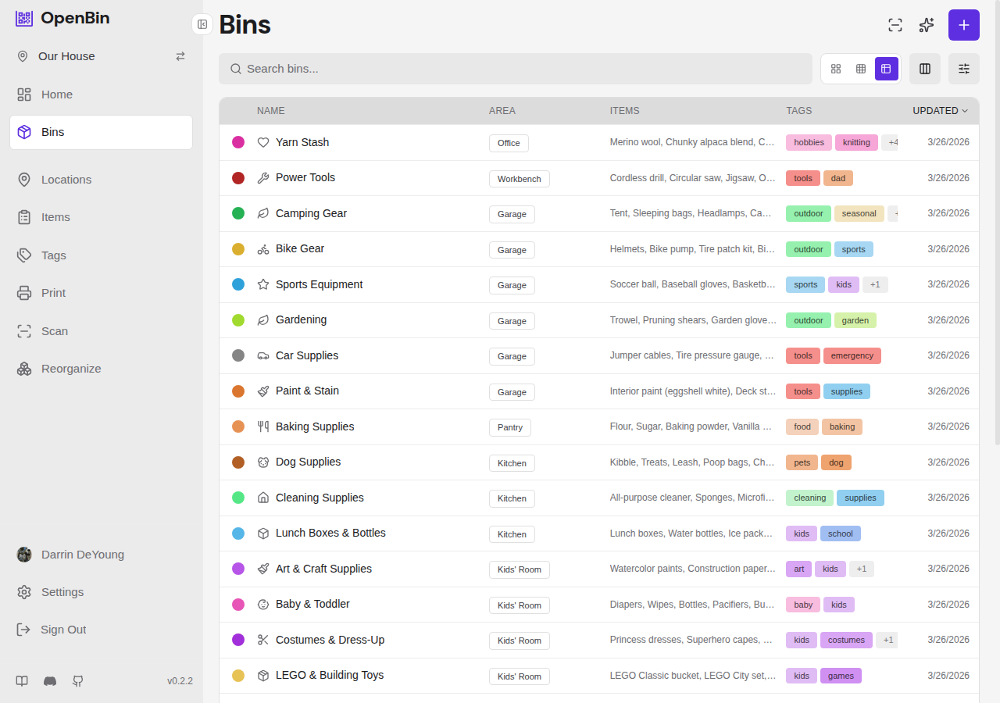

# Screenshots

  

    

      <h4>Dashboard</h4>
      
Pinned bins, saved searches, recently scanned and recently updated.

    

    

      
    

  

  

    

      <h4>Bins</h4>
      
Color-coded bin cards with tags, items, and areas — grid or table view.

    

    

      
    

  

  

    

      <h4>Bin Detail</h4>
      
Edit items with quantities, notes, tags, photos, and custom fields.

    

    

      
    

  

  

    

      <h4>AI Photo Analysis</h4>
      
Snap a photo, AI fills in name, items, tags, and notes.

    

    

      
    

  

  

    

      <h4>Print Labels</h4>
      
Customizable QR label sheets with format and style options.

    

    

      
    

  

  

    

      <h4>Print Names</h4>
      
Colorful name cards with icons — perfect for shelf labels and drawer fronts.

    

    

      
    

  

  

    

      <h4>Print Item List</h4>
      
Text-based inventory checklists with quantities — ideal for audits and packing lists.

    

    

      
    

  

  

    

      <h4>Dark Mode</h4>
      
Full dark theme.

    

    

      
    

  

## View modes

The bin list has three view modes — grid, compact, and table:

  
  
  

